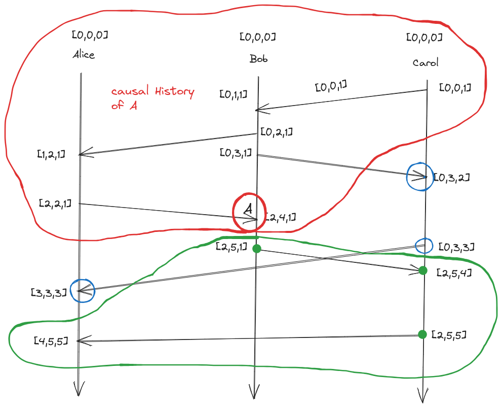

+++
title = 'CSE138: Notes'
date = 2023-10-03T13:57:56+05:30 
mathjax = true
+++
- ### [CSE138 (Distributed Systems) L3: partial orders, total orders, Lamport clocks, vector clocks](https://www.youtube.com/watch?v=UqY1tF3zxjc&list=PLNPUF5QyWU8PydLG2cIJrCvnn5I_exhYx&index=3)
	- **Happens Before:** 
		<figure style="text-align: center;">
  			
  			<figcaption style="color: #ccc; font-style: italic; font-size: 0.9em;"><em>Figure: Happens Before relationship</em></figcaption>
		</figure>

		- if A and B are 2 events in the same process and A happens before B then A -> B
		- if A is a send and B is a corresponding receive then A -> B
		- if A -> B and C -> B then A -> B (transitive)
		- 
		- How are A and E related: A -> B and B -> E so A -> E
		- How are D and A related: Not related 
			- What all places we can go from A ?
				- we can go to B,E,F,G but not D
				- we say that A and D are concurrent 
	- #### Partial Order/Partially Ordered Set: 
		- A set S, together with a binary relation often written as $a \leq b$ (a is related to b this can be the happens before relationship) that lets us compare things in set S and has the following properties
			- Reflexivity: $ x \in A, \ a \leq a $
			- Anti-symmetry: for all $a, b \in A$ if $a \leq b$ and $b \leq a$  then $a = b$ 
			- Transitivity: $a,b,c \in S$ if $a \leq b$ and $b \leq c$ then $a \leq c$ 
		- We have 8 events $\{A, B, C, D, E, F, G, H\}$ 
		- We are checking that whether happens before is actually a partial order
			- Transitivity is satisfied 
			- Anti symmetry is vacuously true
			- Reflexivity is untrue as $a \leq a$ a happens before a is untrue or doesn't make sense
		- The above shows that happens before is not a partial order or can be said irreflexive partial order 
		- Example of partial order
			- set containment 
			- the subsets of set of $\{a,b,c\}$ is a partial order
			- $\{∅,\{a\},\{b\},\{c\},\{a,b\},\{a,c\},\{b,c\},\{a,b,c\}\}$ 
				- $\{a\} \leq \{a\}$  An element is a subset of itself 
				- $\{a,b\} \leq  \{a,b\}$ and $\{a,b\} \geq  \{a,b\}$ 
				- $\{a\} \subseteq \{a,b\}$ and $\{a,b\} \subseteq \{a,b,c\}$ then $\{a\} \subseteq \{a,c\}$ 
		- Elements that are not comparable, for those happens before relation says they are concurrent, those are the elements not ordered by partial order 
		- In total order every pair of event is ordered 
	 - ### Clocks
		 - Physical Clocks
			 - Time of day clocks
			 - monotonic clocks 
		 - Logical Clocks: Ordering of events
			 - Lamport clocks 
				 - Assigning number to events 
				 - Denoted as LC(A): Lamport clock of event A
				 - clock condition: if $a \to b$  then $LC(A) \leq LC(B)$ 
				 -  **Lamport clocks are consistent with causality** 
			- Lamport clock algorithm
				- Every process has to keep a counter initialized to 0
				- On every event on a process that counter has to increment by 1
				- When you send a message, a process needs to include its current counter in the message 
				- When receiving a message, a process sets its counter to the max(local-counter, received-counter) + 1
			-  
			- if $a \to b$  then $LC(A) \leq LC(B)$ but the reverse is not true 
			- 
			- Lamport clocks are consistent with (potential) causality 
				- A -> B then logical clock of A < Logical clock of B
				- characterizes causality
					- if LC(A) < LC(B) then A -> B Lamport clocks do not have this property 
			- What something we can do with Lamport clocks ?
				- what can we do with P -> Q 
				- we can take its contrapositive 
				- if P implies Q then
					- not Q implies not P or $\neg Q \Rightarrow \neg P$ 
					- $A \rightarrow B \ \Rightarrow \quad LC(A) < LC(B)$ 
					- $\neg \ (LC(A) < LC(B)) \Rightarrow \neg \ (A \to B)$ 
					- We can rule out the possibility that A happens before B
					- It might be the case that $ B \rightarrow A \ or \ A \parallel B $
				- Lamport clocks can help in ruling out things
		 - #### Vector Clocks
			 - $A \rightarrow B \ \Rightarrow  LC(A) < LC(B)$  (Lamport clocks)
			 - LC are "consistent with causality"
			 - The other direction ("characterizes causality") doesn't hold
			 - Clocks that is consistent with causality and characterizes causality 
			 - $A \rightarrow B \ \Leftrightarrow LC(A) < LC(B)$  
				 1. Every process keeps a vector (length N for N processes) of integers initialized to 0 $[0,0,0]$ 
				 2. On every event, a process increments its own vector clock(all events: sends, receive and internal events)
				 3. when sending a message, a process includes its current vector clock (after the increment from step 2, because sends are events)
				 4. when receiving a message, a process will update its vector clock to the maximum(local,received). local is its own vector clock after incrementing its position, because receives are events
			- Max of vectors
				- $[1,12,4]$ and $[7,0,2]$ will be $[7,12,4]$  (pointwise maximum)
			- Suppose we have a vector clock of $[5,0,0]$ for alice, bob and carol this means alice has seen 5 events whereas bob and carol haven't seen any
- ### [CSE138 (Distributed Systems) L4: vector clocks, FIFO/causal/totally-ordered delivery](https://www.youtube.com/watch?v=5BHizc7BPyE)
	- 
	- All the elements in the red circle constitute the causal history of A
	- Their vector clocks are smaller than A (the value of elements are smaller in every position)
	- The events in the blue circle are the events that are concurrent or causally independent with A
- ### Protocols
	- A set of rules that processes use to communicate with each other
	- #### correctness property of execution
		- FIFO Delivery: if a process sends message m2 after m1, any process delivering both delivers m1 first and then m2
			- sending a message is something you do
			- Receiving a message is something that happens to you
			- Delivering a message is something you can do with a message you receive (you queue up a received messages and wait to deliver them)
			- Violation of FIFO delivery
			- 
			- What can we do to implement FIFO delivery
				- Sequence numbers: Tag your messages with sender id and sender sequence number 
				- senders increment there sequence number after sending the message
				- if a received message sequence number is the SN of the prev message from that sender + 1, deliver that message
			- What will happen if a message doesn't gets delivered 
				- 
				- using sequence numbers only works well if you have reliable delivery 
				- TCP has reliable delivery 
					- suppose we don't have reliable delivery
				 - 
				 - Vacuously satisfies FIFO delivery
				 - After every message receive bob can send ack, this also guarantees FIFO delivery but is also slow and ack could also get lost
				- 
- ### Causal Delivery
	- if m1 send happened before m2 send then m1's delivery must happen before m2's delivery 
	- 
	- How to enforce causal delivery? (Hint: Using vector clocks)
	- Correctness property of execution
		- FIFO delivery
		- causal delivery
		- Totally ordered delivery 
- ### Totally Ordered Delivery
	- if a process delivers m1 and then m2, then all processes delivering both m1 and m2 deliver m1 first and then m2
	- 