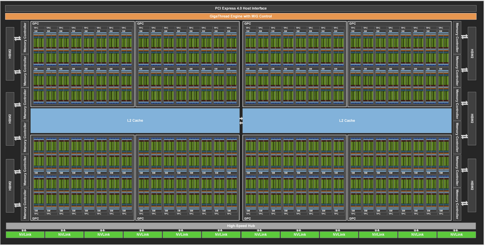
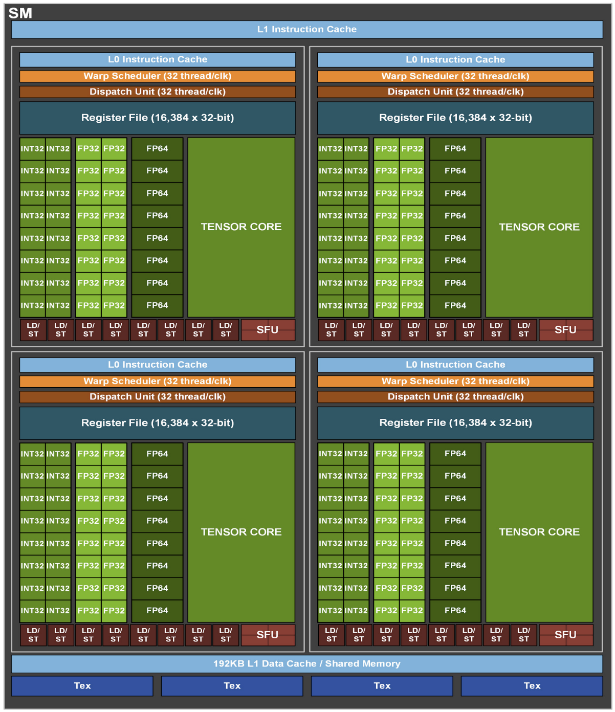
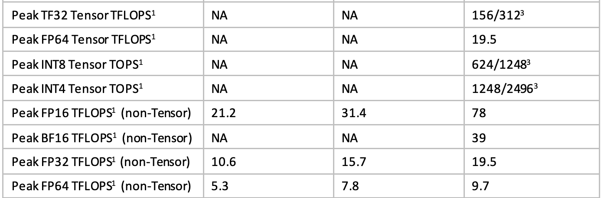

+++
title = 'Understanding GPU FLOPs Through a Matrix Multiplication'
date = 2026-08-16T17:20:00+05:30
math = true
# Shown when someone shares a link to this post. It does not appear on the page.
images = ["cover-a100-full-gpu.png"]
+++



Every Nvidia GPU release comes with numbers like "19.5 TFLOPS FP32" or "312 TFLOPS Tensor". What do these mean? Where do they come from? The answer is not complicated and can be found by simple mathematics. I walk you through a simple example of matrix multiplication to derive these numbers for modern GPUs like A100 or H100.

Matrix multiplications are at the heart of neural network training and inference. They are used to multiply matrices of input data and weights in various layers. A general formula for that can be

$$ D = AB + C $$

Matrices A, B, C, D are of 4 x 4 dimensions.

D = A x B + C (unexpanded)

$$
\begin{bmatrix} d_{11} & d_{12} & d_{13} & d_{14} \\ d_{21} & d_{22} & d_{23} & d_{24} \\ d_{31} & d_{32} & d_{33} & d_{34} \\ d_{41} & d_{42} & d_{43} & d_{44} \end{bmatrix} =
\begin{bmatrix} a_{11} & a_{12} & a_{13} & a_{14} \\ a_{21} & a_{22} & a_{23} & a_{24} \\ a_{31} & a_{32} & a_{33} & a_{34} \\ a_{41} & a_{42} & a_{43} & a_{44} \end{bmatrix} \times
\begin{bmatrix} b_{11} & b_{12} & b_{13} & b_{14} \\ b_{21} & b_{22} & b_{23} & b_{24} \\ b_{31} & b_{32} & b_{33} & b_{34} \\ b_{41} & b_{42} & b_{43} & b_{44} \end{bmatrix} +
\begin{bmatrix} c_{11} & c_{12} & c_{13} & c_{14} \\ c_{21} & c_{22} & c_{23} & c_{24} \\ c_{31} & c_{32} & c_{33} & c_{34} \\ c_{41} & c_{42} & c_{43} & c_{44} \end{bmatrix}
$$

Fully expanded D

$$
D =
\begin{bmatrix}
a_{11}b_{11}+a_{12}b_{21}+a_{13}b_{31}+a_{14}b_{41}+c_{11} & a_{11}b_{12}+a_{12}b_{22}+a_{13}b_{32}+a_{14}b_{42}+c_{12} & a_{11}b_{13}+a_{12}b_{23}+a_{13}b_{33}+a_{14}b_{43}+c_{13} & a_{11}b_{14}+a_{12}b_{24}+a_{13}b_{34}+a_{14}b_{44}+c_{14} \\[6pt]
a_{21}b_{11}+a_{22}b_{21}+a_{23}b_{31}+a_{24}b_{41}+c_{21} & a_{21}b_{12}+a_{22}b_{22}+a_{23}b_{32}+a_{24}b_{42}+c_{22} & a_{21}b_{13}+a_{22}b_{23}+a_{23}b_{33}+a_{24}b_{43}+c_{23} & a_{21}b_{14}+a_{22}b_{24}+a_{23}b_{34}+a_{24}b_{44}+c_{24} \\[6pt]
a_{31}b_{11}+a_{32}b_{21}+a_{33}b_{31}+a_{34}b_{41}+c_{31} & a_{31}b_{12}+a_{32}b_{22}+a_{33}b_{32}+a_{34}b_{42}+c_{32} & a_{31}b_{13}+a_{32}b_{23}+a_{33}b_{33}+a_{34}b_{43}+c_{33} & a_{31}b_{14}+a_{32}b_{24}+a_{33}b_{34}+a_{34}b_{44}+c_{34} \\[6pt]
a_{41}b_{11}+a_{42}b_{21}+a_{43}b_{31}+a_{44}b_{41}+c_{41} & a_{41}b_{12}+a_{42}b_{22}+a_{43}b_{32}+a_{44}b_{42}+c_{42} & a_{41}b_{13}+a_{42}b_{23}+a_{43}b_{33}+a_{44}b_{43}+c_{43} & a_{41}b_{14}+a_{42}b_{24}+a_{43}b_{34}+a_{44}b_{44}+c_{44}
\end{bmatrix}
$$

Let's look at one element of $d_{11} = a_{11}b_{11}+a_{12}b_{21}+a_{13}b_{31}+a_{14}b_{41}+c_{11}$,
or in general

$$ D_{ij}=C_{ij}+\sum_{k=1}^4 A_{ik}B_{kj} $$

This operation is called fused multiply and add (FMA). In code terms:

```text
acc = C_ij                      ← accumulator starts here
for k = 1 to 4:
    acc = acc + A[i][k] * B[k][j]   ← this line = 1 FMA, repeated 4 times
D[i][j] = acc                   ← final accumulated value
```

To find the value of each element in the D matrix we have to do 4 FMA operations. We have 16 elements, so in total we have to do 4 x 16 = 64 FMA operations.

In a modern Nvidia GPU like the A100 or H100, there are several cores that can do these FMA operations.



*Source: [NVIDIA Ampere Architecture whitepaper](https://images.nvidia.com/aem-dam/en-zz/Solutions/data-center/nvidia-ampere-architecture-whitepaper.pdf)*

The above image is of a streaming multiprocessor (SM) from Nvidia's A100 GPU. SMs are roughly analogous to cores of CPUs. The A100 GPU has 108 SMs. The tiles in green are the compute cores inside the SM. There are different types of cores responsible for doing the FMA operations. In the above image we can see there are 4 different types of green tiles: INT32, FP32, FP64 and Tensor core.

What do these numbers INT32, FP32 and FP64 mean? Generally, these are data types used to store and process numbers. INT32 means 32 bit integer. Similarly FP32 means 32 bit floating point number. We allocate these many bits to represent a number.

Each of these cores is responsible for doing FMA operations on the data types they represent. A single FP32 core will have an FMA unit built into it. Every clock cycle, it can take 2 numbers $a$ and $b$ and add one $c$. The output is $a * b + c$. We are doing 1 FMA/clock on each core, and each FMA has 2 floating point operations (FLOPS): 1 addition and 1 multiplication. In total we have 2 FLOPS/clock per core.

For FP32, 64 cores are present per SM, and with a total of 108 SMs in an A100 GPU, 108 SMs × 64 cores/SM = 6,912 cores.

Now let's calculate how many FLOPS all the FP32 cores can do.

$$\underbrace{6{,}912}_{\text{cores}} \times \underbrace{2}_{\text{FLOPs/clock/core}} \times \underbrace{1.41\times10^{9}}_{\text{clocks/sec}} = 19.49\times10^{12}\ \text{FLOPs/sec} \approx 19.5\ \text{TFLOPS}$$

All the FP32 cores in an A100 can do 19.5 Tera-FLOPS per second. 

But what about tensor cores? How are they different from our usual FP32 cores?

If we want to do the 4x4 matrix multiplication using only FP32 cores, we can assign 16 CUDA cores (one per output element of the 4×4 result matrix). Each core still has to sequentially do its own 4-step FMA chain (summing over `k = 1 to 4`).

Clock 1: acc = $c_{ij} + a_{i1}*b_{1j}$
Clock 2: acc += $a_{i2}*b_{2j}$
Clock 3: acc += $a_{i3}*b_{3j}$
Clock 4: acc += $a_{i4}*b_{4j}$   → done

Result: **4 clock cycles**, using 16 CUDA cores in parallel. A Volta tensor core (the generation before the A100 tensor core), by contrast, can do 64 FMA per clock cycle, so the whole operation can be done in 1 clock cycle.

The A100 has 4 tensor cores per SM, so a total of 108 x 4 = 432 cores, with a capability of 256 FMA/clock = 512 FLOPs/clock/core.

$$\underbrace{432}_{\text{Tensor Cores}} \times \underbrace{512}_{\text{FLOPs/clock/core}} \times \underbrace{1.41\times10^{9}}_{\text{clocks/sec}} = 311.9\times10^{12}\ \text{FLOPs/sec} \approx 312\ \text{TFLOPS}$$

Here are the official figures for these estimated numbers.



*Source: [NVIDIA Ampere Architecture whitepaper](https://images.nvidia.com/aem-dam/en-zz/Solutions/data-center/nvidia-ampere-architecture-whitepaper.pdf)*

As an exercise, you can calculate these values for other core types.
